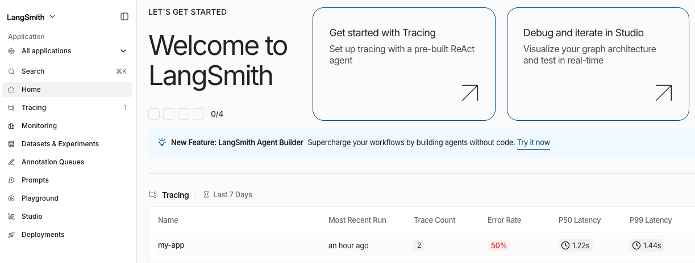
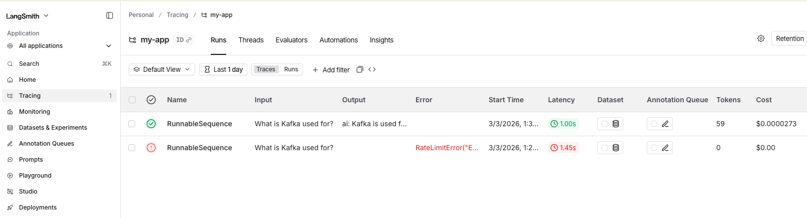

# A basic program to chain a prompt and a call to LLM
Observe the trace of the LLM call in Langsmith

- [Env Settings](#Env-Settings)
- [Run the LLM Application](#Run-the-LLM-Application)
- [Observe the trace in Langsmith](#Observe-the-trace-in-Langsmith)
- [Troubleshoot](#Troubleshoot)

## Env Settings
```
> . ./basic_chain.env

> env | egrep "LANGCHAIN|OPENAI"
OPENAI_API_KEY=sk-svcacct-**************
LANGCHAIN_TRACING_V2=true
LANGCHAIN_PROJECT=my-app
LANGCHAIN_API_KEY=lsv2_sk_***************
```
## Run the LLM Application
```
> python3 ./langchain_basic.py
Kafka is used for building real-time data pipelines and streaming applications. It allows for the processing and analyzing of high-throughput data streams, enabling the integration of data from multiple sources and facilitating event-driven architectures.
```
## Observe the trace in LangSmith
#### Top Level Dashboard
[]()
#### Click on the row for a granular view of latency, tokens, cost
[]()

## Troubleshoot
Either you used up all the credits with your free tier account in OpenAI OR you are firing too many calls in a short span.
```
openai.RateLimitError: Error code: 429 - {'error': {'message': 'You exceeded your current quota, please check your plan and billing details. For more information on this error, read the docs: https://platform.openai.com/docs/guides/error-codes/api-errors.', 'type': 'insufficient_quota', 'param': None, 'code': 'insufficient_quota'}}
```
The langchain api key scope cannot be at the Org level, delete/create a new key with workspace scope
```
Failed to send compressed multipart ingest: langsmith.utils.LangSmithError: Failed to POST https://api.smith.langchain.com/runs/multipart in LangSmith API. HTTPError('403 Client Error: Forbidden for url: https://api.smith.langchain.com/runs/multipart', '{"error":"org_scoped_key_requires_workspace","message":"This API key is org-scoped and requires workspace specification. Please provide \'workspaceId\' parameter, or set LANGSMITH_WORKSPACE_ID environment variable. You may also want to upgrade your LangSmith SDK to use org-scoped keys."}\n')
```
