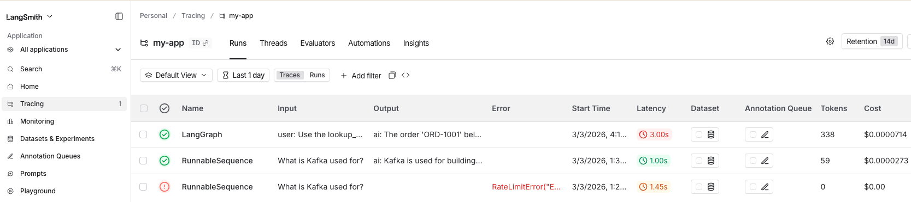

# An LLM application to 
- Creates a langchain agent 
- Creates a context with MCP tool calling
- Enriches the prompt  and invoke a LLM
- Observe the trace in Langsmith

## Env Variables
```
> . ./set.env
> env | egrep "LANGCHAIN|OPENAI"
OPENAI_API_KEY=sk-svcacct-**************
LANGCHAIN_TRACING_V2=true
LANGCHAIN_PROJECT=my-app
LANGCHAIN_API_KEY=lsv2_sk_***************
```
## Run the Python Program
```
> python3 ./langchain_mcp.py
The order 'ORD-1001' belongs to the customer Alice and has a total amount of $42.50.
```

## MCP Server
In this example the agent imports the MCP Server as a python module.

You can wire the MCP server into an MCP host (Claude Desktop, Cursor, etc.) 

This depends on your FastMCP version and transport (stdio / HTTP / SSE), but the important part is:

`lookupByKey` is now a first‑class MCP tool implemented once in mcp_backend.lookup_order().

## LangChain Agent
Key points:

No duplication of business logic: lookup_order() in the mock mcp_backend.py is the single source of truth.

FastMCP: wraps that function as a tool (lookupByKey) for MCP‑speaking clients.

LangChain: wraps the same function as a StructuredTool and gives it to a ReAct‑style agent.

## Observe the trace in LangSmith
[]()
